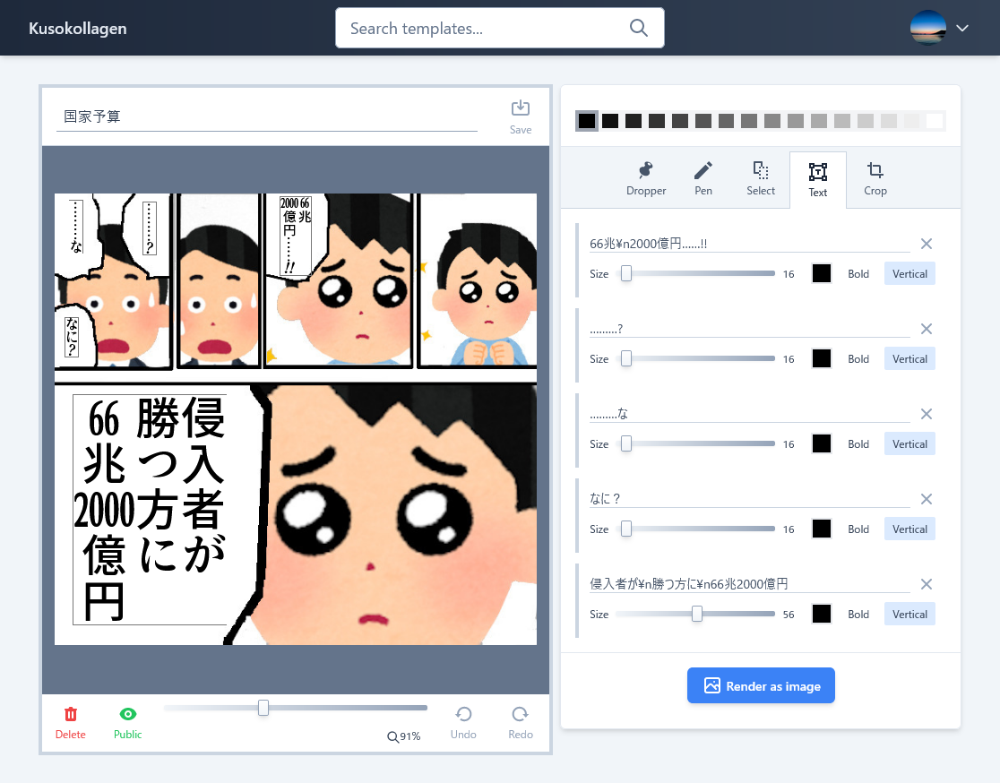

- [Live demo](https://yubrot.github.io/kusokollagen/)

# About

Kusokollagen is a web application to quickly generate "Kusokora" images.

I have deleted the backend implementation once. The implementation can be found in the [legacy-studio](/yubrot/kusokollagen/tree/legacy-studio) branch.

# Resources

- Icons
  - [Heroicons](https://heroicons.com/)
  - [Zondicons](http://www.zondicons.com/icons.html)
  - [Entypo](http://www.entypo.com/)
- Fonts
  - [GenEi Antique](http://okoneya.jp/font/) ([SIL Open Font License](http://scripts.sil.org/OFL))
- Screenshot images
  - [いらすとや](https://www.irasutoya.com/)
